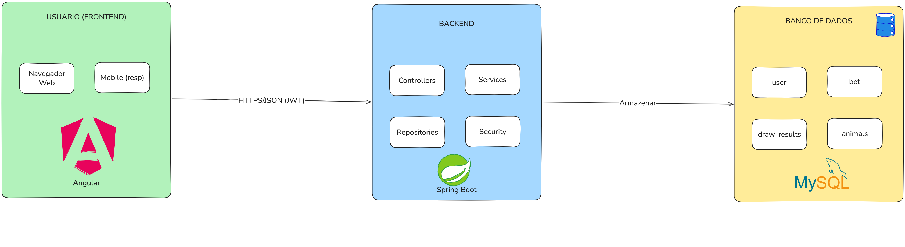

# 🎲 BichoFull

Simulação educacional do **Jogo do Bicho**, com autenticação segura, arquitetura REST e testes automatizados.

Projeto full stack onde usuários criam conta, recebem saldo fictício (R$ 1.000,00) e realizam apostas simuladas.

---

# 🎯 Objetivo do Projeto

Desenvolver uma aplicação full stack aplicando:

* Arquitetura REST
* Autenticação stateless com JWT
* Separação entre entidade e DTO
* Testes automatizados
* Integração Contínua (CI)
* Boas práticas de backend com Spring Boot

---


📋 **Regras de Negócio**

- **25 animais** (grupos de 01 a 25), cada um com 4 dezenas
- **Tipos de aposta:** Grupo, Dezena, Centena, Milhar
- **Premiação:** Grupo (18x), Milhar (4000x) - apenas 1º prêmio
- **Saldo inicial:** R$ 1.000,00 (não pode ficar negativo)
- **Sorteio:** 5 milhares aleatórias (manual via admin)


⚡ **Principais Funcionalidades**

| Categoria | Funcionalidade | Descrição |
|-----------|----------------|-----------|
| 👤 **Usuário** | Cadastro | Criação de conta com nome, e-mail e senha |
| 👤 **Usuário** | Login | Autenticação segura via JWT |
| 👤 **Usuário** | Saldo inicial | R$ 1.000,00 fictícios para começar a apostar |
| 👤 **Usuário** | Carteira virtual | Saldo atualizado em tempo real |
| | | |
| 🎲 **Apostas** | Tabela de animais | Interface com os 25 grupos do jogo do bicho |
| 🎲 **Apostas** | Aposta por Grupo | Escolha um animal (1 a 25) |
| 🎲 **Apostas** | Aposta por Dezena | Escolha dois números (00 a 99) |
| 🎲 **Apostas** | Aposta por Milhar | Escolha quatro números (0000 a 9999) |
| 🎲 **Apostas** | Validação de saldo | Impede apostas com saldo insuficiente |
| | | |
| 🏆 **Sorteios** | Sorteio automático | Geração aleatória de 5 milhares |
| 🏆 **Sorteios** | Sorteio manual | Admin pode simular sorteios |
| 🏆 **Sorteios** | Cálculo de prêmios | Grupo: 18x | Milhar: 4000x (1º prêmio) |
| | | |
| 📊 **Histórico** | Histórico de apostas | Visualização de apostas realizadas |
| 📊 **Histórico** | Resultados | Ganhos/perdas por aposta |

  
---

# ⚡ Status Atual (Semana 2)

* ✅ Cadastro de usuário
* ✅ Login com JWT
* ✅ Saldo inicial automático (R$ 1.000,00)
* ✅ Rota protegida `/api/users/me`
* ✅ Segurança stateless configurada
* ✅ Filtro JWT customizado
* ✅ Testes unitários implementados (6 testes)
* ✅ Banco de dados rodando via Docker
* ✅ H2 configurado para ambiente de testes
* ✅ CI rodando via GitHub Actions

---

# 🔐 Autenticação

A aplicação utiliza:

* JWT (Bearer Token)
* Spring Security
* PasswordEncoder (BCrypt)
* Filtro customizado `JwtAuthenticationFilter`
* Segurança stateless

### Fluxo:

1. Usuário faz login
2. Backend gera JWT
3. Frontend envia token no header:

   ```
   Authorization: Bearer <token>
   ```
4. Filtro valida token antes de acessar rotas protegidas

---

# 📡 Endpoints Implementados

## 🔹 Auth

| Método | Endpoint             | Descrição              |
| ------ | -------------------- | ---------------------- |
| POST   | `/api/auth/register` | Cadastro de usuário    |
| POST   | `/api/auth/login`    | Login e geração de JWT |

---

## 🔹 Usuário

| Método | Endpoint        | Descrição                            |
| ------ | --------------- | ------------------------------------ |
| GET    | `/api/users/me` | Retorna dados do usuário autenticado |


---

# 🧪 Testes Automatizados

Testes implementados:

* Cadastro com sucesso
* Cadastro com email duplicado
* Login com sucesso
* Login com senha inválida
* Teste de contexto Spring
* Teste de repositório

Execução local:

```bash
./mvnw test
```

---

# 🔄 Integração Contínua (CI)

GitHub Actions configurado para:

* Build automático
* Execução de testes
* Validação a cada push ou pull request

Se algum teste falhar, o build é interrompido.

---

# 🛠️ Stack

| Camada            | Tecnologia                   |
| ----------------- | ---------------------------- |
| Backend           | Spring Boot 3                |
| Segurança         | Spring Security + JWT        |
| Banco             | MySQL (Docker)               |
| Banco para testes | H2 (in-memory)               |
| Build             | Maven                        |
| CI/CD             | GitHub Actions               |
| Frontend          | Angular (em desenvolvimento) |

---

# 🏗️ Arquitetura



Frontend → Backend → Banco

A aplicação segue:

* Arquitetura em camadas
* Separação de responsabilidades
* DTO para exposição de dados
* Entidades isoladas da API


---

# 👤 Autora

**Sanna Damasceno**

Projeto educacional – Full Stack Application
